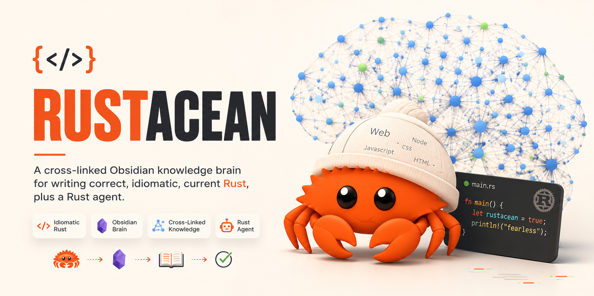

# Rustacean: A Rust Knowledge Brain

**Rustacean is a cross-linked Obsidian knowledge brain for writing correct, idiomatic, current Rust.** It is 584 atomic, interlinked notes (concepts, patterns, and anti-patterns) plus 34 domain maps, all targeting Rust edition 2024 and stable 1.85+, sourced from the official books and the standard-library API, and reviewed for currency. Open it in Obsidian and look something up, or hand a task to the built-in Rust Secretary agent.


> Not a tutorial and not a doc mirror. It is the opinionated layer on top of the docs: for every topic you get the idiomatic way to do it, the mistake to avoid, a compilable example, and links to everything related.

## Why it exists

- **Code with trust.** Every atomic note opens with a one-line answer, then a minimal compilable `rust` example, a "best practice" list, a "pitfalls" list, and dense `[[links]]`. You act on the note without leaving it.
- **Current, not stale.** Targeted at edition 2024 and stable 1.85+. Currency was checked against the books and the standard-library pages, and a separate review pass caught real version drift (for example, `Result::flatten` requires Rust 1.89+).
- **Connected, not flat.** 13,400+ wikilinks at 100 percent resolution turn the docs into a graph you can wander: a concept links to its patterns, its anti-patterns, and its domain map.

## Who this is for

- **Rust developers** who want a fast lookup that returns the idiomatic answer plus the footgun next to it.
- **Teams** that want a shared, opinionated reference keyed to a single edition, instead of ten browser tabs.
- **Anyone learning Rust** who wants the Book and Reference distilled into atomic, linkable notes with a Rustlings practice map.

## Table of Contents

- [What is inside](#what-is-inside)
- [How to use it](#how-to-use-it)
- [The Rust Secretary](#the-rust-secretary)
- [How it was built](#how-it-was-built)
- [Quality and verification](#quality-and-verification)
- [Staying current](#staying-current)
- [Regenerating the corpus](#regenerating-the-corpus)
- [Repository layout](#repository-layout)
- [Roadmap](#roadmap)
- [Contributing](#contributing)
- [Attribution](#attribution)
- [License](#license)
- [Author](#author)

## What is inside

The brain lives in `wiki/`. Start at `wiki/Rust Brain Home.md`.

| Layer | Count | What it is |
| --- | --- | --- |
| Concepts | 313 | Language and standard-library ideas (ownership, lifetimes, traits, async, unsafe, and more) |
| Patterns | 123 | Idioms and best practices (newtype, builder, error handling, RAII guards, crate playbooks) |
| Anti-patterns | 68 | Footguns and the correct alternative (needless clone, blocking in async, stringly-typed code) |
| Domain maps (MOCs) | 34 | One hub per domain, grouping its concepts, patterns, and anti-patterns |
| Source notes | 37 | Provenance notes for the official books, std pages, and research reports |

Coverage spans 34 domains: language core, the standard library (Vec, String, Option, Result, iterators, collections, traits, I/O), error handling, generics and lifetimes, closures and iterators, smart pointers, concurrency, async, unsafe and FFI, macros, advanced type system, cargo and dependencies, performance, testing, editions, WebAssembly and `no_std`, crate playbooks, and a Rustlings practice map.

## How to use it

1. Open this folder as an Obsidian vault (this repo ships the `.obsidian/` config and graph colors).
2. Open `wiki/Rust Brain Home.md`. Pick a domain map, or jump to a note and follow the `[[links]]`.
3. For a full catalogue, open `wiki/index.md`. For the cross-cutting "do this, avoid that" summary, open `research/99-rust-mastery-synthesis.md`.

Strong starting notes: `Ownership`, `Result`, `The Question Mark Operator`, `Traits`, `Lifetimes`, `Async Rust`, `Unsafe Rust`.

## The Rust Secretary

Rustacean ships with a Rust agent grounded in the brain, for coding, changes, and reviews.

```bash
./rust-secretary.sh "how do I return an iterator from a function?"
EFFORT=xhigh ./rust-secretary.sh "review src/parser.rs against the brain's best practices"
```

- `AGENTS.md` defines the mandate, so any agent runner that reads it (for example Codex) acts as the Secretary inside this folder.
- The Secretary reads the brain first, answers in edition-2024 style, cites the note and the official URL, and keeps the notes themselves up to date.

## How it was built

Rustacean was assembled by an orchestrated, multi-agent pipeline, then reviewed:

1. **Corpus.** The official Rust books were captured as structured markdown, the standard-library API pages were scraped, and ten deep-research reports on best practices and pitfalls were produced and adversarially verified.
2. **Synthesis.** Sub-agents wrote atomic notes for each domain against a fixed authoring contract (`wiki/meta/CONVENTIONS.md`) and a gold-standard exemplar (`wiki/concepts/Ownership.md`).
3. **Depth pass.** Every note was expanded with second examples, "common errors" sections that show the real compiler diagnostic, and wider cross-linking. Average note depth went from roughly 70 to roughly 120 lines.
4. **Review.** An independent reviewer (the Rust Secretary, at extra-high reasoning) audited the whole vault, fixed dead links and a real currency bug, and wrote `wiki/meta/secretary-review.md`. A final gap-fill wave closed the remaining coverage holes.

The prompts and generators that drove this live in `.codex-build/` for full transparency.

## Quality and verification

- **584 notes, 100 percent wikilink resolution** across 13,400+ links.
- **Full compliance:** every atomic note has valid frontmatter, exactly one title, a `rust` example, at least six links, and cited sources.
- **Currency verified** against edition 2024 (for example `unsafe extern` blocks, `&raw const` / `&raw mut`, const `Mutex::new`, thiserror 2.x).
- **Independent review:** `wiki/meta/secretary-review.md`, verdict PASS-WITH-FIXES, zero blockers.

One honest caveat: code examples have not been compiler-checked in this environment (no `rustc` / `cargo` present). A `cargo`-based doctest pass is the recommended next gate. See [Roadmap](#roadmap).

## Staying current

Rust ships every six weeks. The provenance ledger (`references/source-ledger.json`) tracks each source and its refresh-due date. To refresh:

```bash
./scrape-rust-docs.sh            # re-capture the official books
bash .codex-build/scrape-std.sh  # re-capture the standard-library pages
```

Then ask the Secretary to reconcile changed notes. The backlog of upcoming work is in `wiki/Coverage Backlog.md`.

## Regenerating the corpus

To keep the repository lean, the upstream source tree (`rust/`) and the raw ingestion copies (`.raw/`) are not committed. Regenerate them locally:

```bash
# Standard-library source, std, core, alloc (about 450 MB, shallow)
git clone --depth 1 https://github.com/rust-lang/rust.git rust

# Official books and std pages as markdown
./scrape-rust-docs.sh
bash .codex-build/scrape-std.sh
```

## Repository layout

```
wiki/         the brain: atomic notes + domain maps (start at wiki/Rust Brain Home.md)
  concepts/   patterns/   antipatterns/   mocs/   sources/   meta/
research/     verified deep-research reports + 99-rust-mastery-synthesis.md
references/   provenance: source-ledger.json, product-spec, safety-gates, refresh plan
specs/        rust-brain.yaml
.codex-build/ the build harness: prompts and generators (logs are gitignored)
AGENTS.md     the Rust Secretary mandate (read by Codex and compatible runners)
rust-secretary.sh   launcher for the Secretary agent
scrape-rust-docs.sh the corpus scraper
```

## Roadmap

- Compiler-check every `rust` example with a `cargo`-based doctest pass.
- Deepen the newest notes and add the remaining items in `wiki/Coverage Backlog.md` (std deep dives, more crate playbooks).
- Add diagrams and a cover image, then make the repository public.

## Contributing

Contributions are welcome: fix an incorrect or stale note, add a missing one from `wiki/Coverage Backlog.md`, or open an issue.

- **Read [CONTRIBUTING.md](CONTRIBUTING.md) first.** Every note follows the authoring contract in [`wiki/meta/CONVENTIONS.md`](wiki/meta/CONVENTIONS.md): valid frontmatter, an answer-first opening, a minimal compilable `rust` example, ✅ best-practice and ⚠️ pitfalls lists, at least six `[[wikilinks]]`, and cited sources, all current to edition 2024 / stable 1.85+.
- **Keep links resolving.** CI runs `python3 scripts/check-wikilinks.py wiki`; it must report 0 unresolved before a change merges.
- **Be kind, report safely.** This project follows the [Contributor Covenant](CODE_OF_CONDUCT.md). To report a problem privately, see [SECURITY.md](SECURITY.md); to ask a question, see [SUPPORT.md](SUPPORT.md).

## Attribution

This brain is built from open Rust documentation. The Rust Programming Language, the Reference, Rust by Example, the Rustonomicon, the Cargo, rustc, and rustdoc books, the Edition Guide, the Embedded Book, and the standard-library docs are works of the Rust project and its contributors, used under their MIT / Apache-2.0 (and CC-BY) terms. Rustacean's original work (the synthesized notes, research reports, scripts, and structure) is MIT licensed. The full text of those books is redistributed in `sources/` under their upstream licenses; see [NOTICE](NOTICE) for the per-source breakdown. Rust and Cargo are trademarks of the Rust Foundation.

## License

MIT. See [LICENSE](LICENSE).

## Author

Built by [Agrici Daniel](https://github.com/AgriciDaniel). Part of the [AI Marketing Hub Pro](https://www.skool.com/ai-marketing-hub-pro) toolset.
